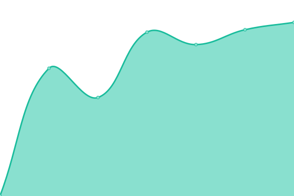
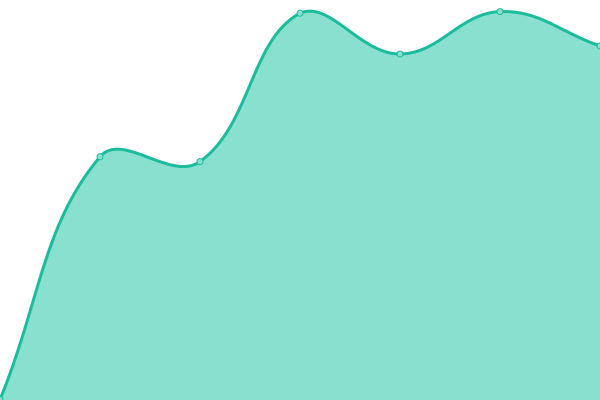

# [📈 Live Status](https://status.nordgedanken.dev): <!--live status--> **🟧 Partial outage**

This repository contains the open-source uptime monitor and status page for [Nordgedanken](nordgedanken.de), powered by [Upptime](https://github.com/upptime/upptime).

With [Upptime](https://upptime.js.org), you can get your own unlimited and free uptime monitor and status page, powered entirely by a GitHub repository. We use [Issues](https://github.com/Nordgedanken/status-nordgedanken-dev/issues) as incident reports, [Actions](https://github.com/Nordgedanken/status-nordgedanken-dev/actions) as uptime monitors, and [Pages](https://status.nordgedanken.dev) for the status page.

<!--start: status pages-->
<!-- This summary is generated by Upptime (https://github.com/upptime/upptime) -->
<!-- Do not edit this manually, your changes will be overwritten -->
<!-- prettier-ignore -->
| URL | Status | History | Response Time | Uptime |
| --- | ------ | ------- | ------------- | ------ |
|  [Fluffychat Fdroid Stable](https://fdroid.fluffychat.im) | 🟩 Up | [fluffychat-fdroid-stable.yml](https://github.com/Nordgedanken/status-nordgedanken-dev/commits/HEAD/history/fluffychat-fdroid-stable.yml) | 

 985ms
     
 | 

<a href="https://status.nordgedanken.dev/history/fluffychat-fdroid-stable">100.00%</a>
    

|  [Fluffychat Fdroid Nightly](https://nightly.fdroid.fluffychat.im/) | 🟩 Up | [fluffychat-fdroid-nightly.yml](https://github.com/Nordgedanken/status-nordgedanken-dev/commits/HEAD/history/fluffychat-fdroid-nightly.yml) | 

 1394ms
     
 | 

<a href="https://status.nordgedanken.dev/history/fluffychat-fdroid-nightly">100.00%</a>
    

|  [Matrix Server](https://matrix.nordgedanken.dev) | 🟥 Down | [matrix-server.yml](https://github.com/Nordgedanken/status-nordgedanken-dev/commits/HEAD/history/matrix-server.yml) | 

 521ms
     
 | 

<a href="https://status.nordgedanken.dev/history/matrix-server">100.00%</a>
    

|  [Funkwhale](https://audio.nordgedanken.dev) | 🟥 Down | [funkwhale.yml](https://github.com/Nordgedanken/status-nordgedanken-dev/commits/HEAD/history/funkwhale.yml) | 

 0ms
     
 | 

<a href="https://status.nordgedanken.dev/history/funkwhale">100.00%</a>
    

|  [Gitlab](https://git.nordgedanken.dev) | 🟥 Down | [gitlab.yml](https://github.com/Nordgedanken/status-nordgedanken-dev/commits/HEAD/history/gitlab.yml) | 

 0ms
     
 | 

<a href="https://status.nordgedanken.dev/history/gitlab">100.00%</a>
    

<!--end: status pages-->

[**Visit our status website →**](https://status.nordgedanken.dev)

## 📄 License

- Powered by: [Upptime](https://github.com/upptime/upptime)
- Code: [MIT](./LICENSE) © [Nordgedanken](nordgedanken.de)
- Data in the `./history` directory: [Open Database License](https://opendatacommons.org/licenses/odbl/1-0/)
